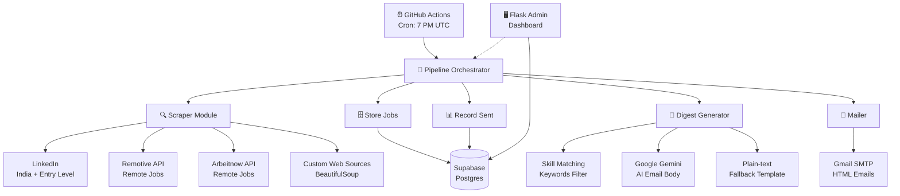
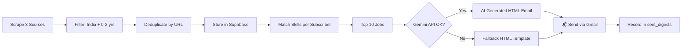
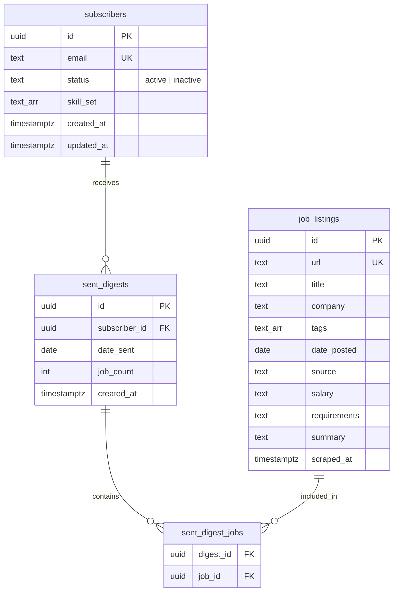

# 🚀 Job Digest Mailer

Automated daily job digest pipeline that scrapes entry-level jobs from multiple sources, matches them to subscriber skills, and delivers personalized HTML email digests — focused on **India-based** and **remote** opportunities.

**POWERED BY Babuaa**

---

## ✨ Features

- 🔍 Scrapes jobs from **LinkedIn**, **Remotive**, and **Arbeitnow** daily
- 🇮🇳 Filters for India-friendly locations (India, Remote, Worldwide)
- 📋 Targets **0-2 years experience** / entry-level roles
- 🤖 AI-powered digest emails via **Google Gemini** (with plain-text fallback)
- 💌 Beautiful HTML emails with job cards, salary, location, and "Apply Now" buttons
- ⏰ Runs daily at **7 PM UTC** via GitHub Actions
- 🗄️ Stores data in **Supabase** (free Postgres)
- 🖥️ Flask **Admin Dashboard** to manage subscribers and view jobs

---

## 🏗️ Architecture



## 📧 Email Flow



## 📂 Project Structure

```
job-outreach/
├── config.py              # Environment config & validation
├── scraper.py             # Multi-source job scraper (LinkedIn, Remotive, Arbeitnow)
├── db.py                  # Supabase database operations
├── digest.py              # Skill matching + HTML email generation
├── mailer.py              # Gmail SMTP sender with rate limiting
├── pipeline.py            # End-to-end orchestrator
├── admin/
│   ├── app.py             # Flask admin dashboard
│   └── templates/         # Jinja2 HTML templates
├── migrations/
│   └── 001_initial_schema.sql
├── tests/
│   ├── conftest.py        # Shared fixtures & Hypothesis strategies
│   └── ...
├── pyproject.toml
└── .env.example
```

## 🗄️ Database Schema



## 🚀 Setup

### 1. Supabase
- Create a free project at [supabase.com](https://supabase.com)
- Run `job-outreach/migrations/001_initial_schema.sql` in the SQL Editor

### 2. Gmail App Password
- Enable 2FA on your Google account
- Create an app password at [myaccount.google.com/apppasswords](https://myaccount.google.com/apppasswords)

### 3. Gemini API Key
- Get a free key at [aistudio.google.com/app/apikey](https://aistudio.google.com/app/apikey)

### 4. GitHub Secrets
Add these in your repo → Settings → Secrets → Actions:

| Secret | Description |
|--------|-------------|
| `GMAIL_USER` | Your Gmail address |
| `GMAIL_APP_PASSWORD` | 16-char app password |
| `GEMINI_API_KEY` | Google Gemini API key |
| `SUPABASE_URL` | Supabase project URL |
| `SUPABASE_KEY` | Supabase anon key |

### 5. Add Subscribers
```sql
INSERT INTO subscribers (email, status, skill_set)
VALUES (
  'you@example.com',
  'active',
  ARRAY['Python','Machine Learning','Data Analysis','Flask','FastAPI']
);
```

## 🏃 Run Locally

```bash
cd job-outreach
cp .env.example .env   # Fill in real values
uv sync
uv run python pipeline.py        # Run the digest pipeline
uv run python admin/app.py       # Start admin dashboard at localhost:5000
```

## ⏰ Automated Schedule

The GitHub Actions workflow runs daily at **7 PM UTC** (12:30 AM IST). You can also trigger it manually from the Actions tab.

## 📊 Job Sources

| Source | Type | Focus |
|--------|------|-------|
| LinkedIn | HTML scraping | India, entry-level |
| Remotive | REST API | Remote, worldwide |
| Arbeitnow | REST API | Remote jobs |

---

**POWERED BY Babuaa** ✨
